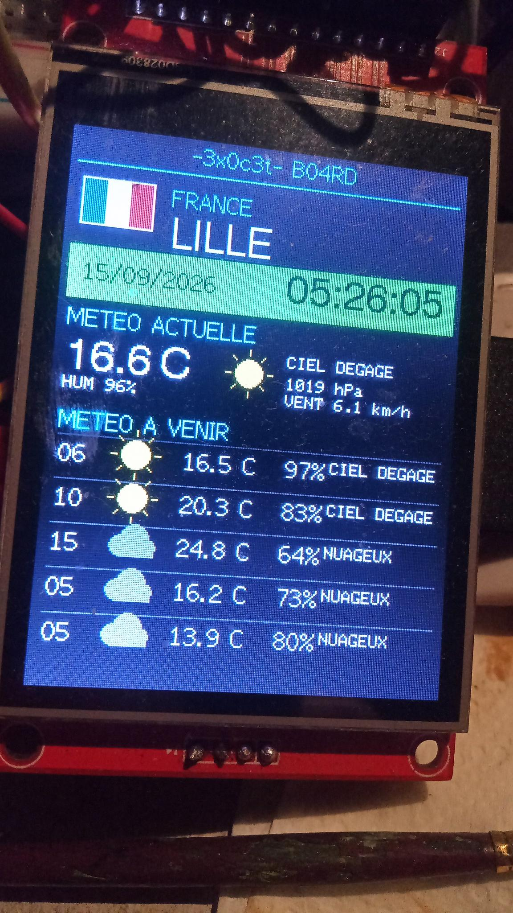

# 3x0c3t BO4RD WE4THER

Station météo sur écran TFT SPI 2.8" ILI9341 piloté par ESP8266 NodeMCU.

Le projet affiche les informations météo de plusieurs localisations avec mise à jour automatique, horloge locale, prévisions et changement de ville manuel ou automatique.

---

## Interface

L'interface est conçue pour un écran TFT ILI9341 240×320 en orientation portrait.



L'écran présente notamment :

- Nom de la ville
- Pays
- Heure locale
- Date
- Température actuelle
- Température ressentie
- Humidité
- Pression atmosphérique
- Vitesse du vent
- Icône météo
- Prévisions à court et moyen terme
- Drapeau correspondant à la localisation

Les prévisions affichées correspondent aux échéances :

- +1h
- +5h
- +10h
- +24h
- +48h

---

## Localisations

Le système prend actuellement en charge trois localisations :

### Lille

France

Latitude : `50.6292`

Longitude : `3.0573`

Fuseau horaire :

`Europe/Paris`

### Veracruz

Mexique

Latitude : `19.1738`

Longitude : `-96.1342`

Fuseau horaire :

`America/Mexico_City`

### XXX

Mexique

Latitude : `XXX`

Longitude : `XXX`

Fuseau horaire :

`America/Mexico_City`

---

## Fonctionnement

Le système récupère les données météorologiques via l'API Open-Meteo.

Les données récupérées comprennent :

- Température
- Température ressentie
- Humidité relative
- Pression atmosphérique
- Vitesse du vent
- Code météo
- Prévisions horaires

La météo est actualisée périodiquement.

L'écran change automatiquement de localisation.

Le bouton permet également de passer manuellement à la localisation suivante.

Ordre de rotation :

```text
LILLE
  ↓
VERACRUZ
  ↓
XXX
  ↓
LILLE